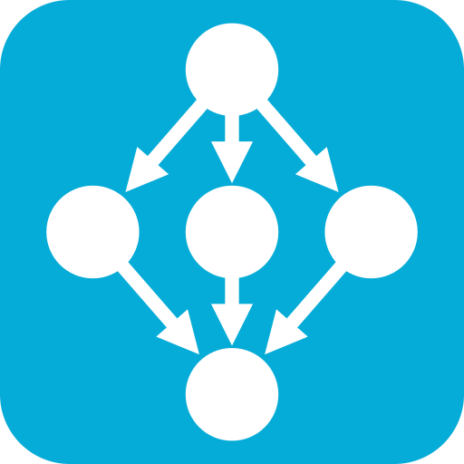

  

# CodeLineage

Shows you how your Go functions are called, so you can get around your projects quicker.

## Features

- Generates call graphs for your Go functions with links to each call site
- Adds shorthand tags to each function to quickly compare call order

## Requirements

**You must have the Go language server (`gopls`) installed locally and available in your `PATH`.** We recommend simply installing the [Go language extension](https://marketplace.visualstudio.com/items?itemName=golang.go) which will automatically install `gopls` on first run.

## Extension Settings

This extension contributes the following settings:

- **`codeLineage.maxPathSegments`: The maximum amount of segments in each lineage path, or `0` for no limit**
    - For example: if a path is `main.3.4.11.1.2.77` and `maxPathSegments` is `3`, it will be shown as `main.3.4`
    - Default: `0`

## Known Issues

- If you have a Go function that returns another Go function, this extension considers the inner function to be "called" where the outer function is called, rather than the true call site.

## Release Notes

### 1.0.0

Initial release of CodeLineage
